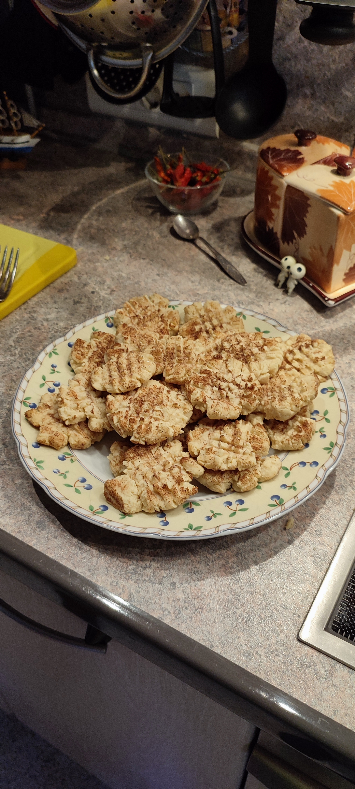

# kodama006.github.io

<!DOCTYPE html>
<html lang="ru" dir="ltr">
<link rel="stylesheet" href="styles.css">

  <head>
    <meta charset="utf-8">
    <title>сайт1</title>
  </head>
  <body>

        

        <table class="table_center_by_css">
        <table border= #>

          <tr> <td> ингридиент </td> <td> кол-во или вес </td> </tr>
          <tr> <td> мука </td> <td> 260 грамм</td> </tr>
          <tr> <td> сахар </td> <td> 100 грамм</td> </tr>
          <tr> <td> яйцо </td> <td> 1 штук </td> </tr>
          <tr> <td> масло </td> <td> 120 грамм </td> </tr>
          <tr> <td> разрыхлитель </td> <td> 1/2 ч. л. </td> </tr>
        </table>

      <h2><b> Как приготовить печенье </b></h2>

      
1. Возьмите яйцо и разбейте его, затем по чуть-чуть добавляйте сахар(100 грамм) и размешивайте миксером до однородной массы. 

      
2. Добавьте 120 грамм масла и взбивайте до крема. 

      
3. Добавьте 260 грамм муки и 1/2 ч.л разрыхлителья. Замешайте лопаткой.

      
4. Когда получится комочек, возьмите его и начните вымешивать на столе.

      
5. Заверните в пищевую плёнку и отправьте на пол часа в холодильник.

      
6. Достаньте тесто и, отщипывая кусочки по 21 грамма, сформируйте шарики, придавливая их вилкой крест на крест.

      
7. Украсьте печеньки сахаром.

      
8. Отправьте в духовку на 10 минут при температуре 180 градусов.

      
9. Печенье готово!!!

  </body>
</html>
